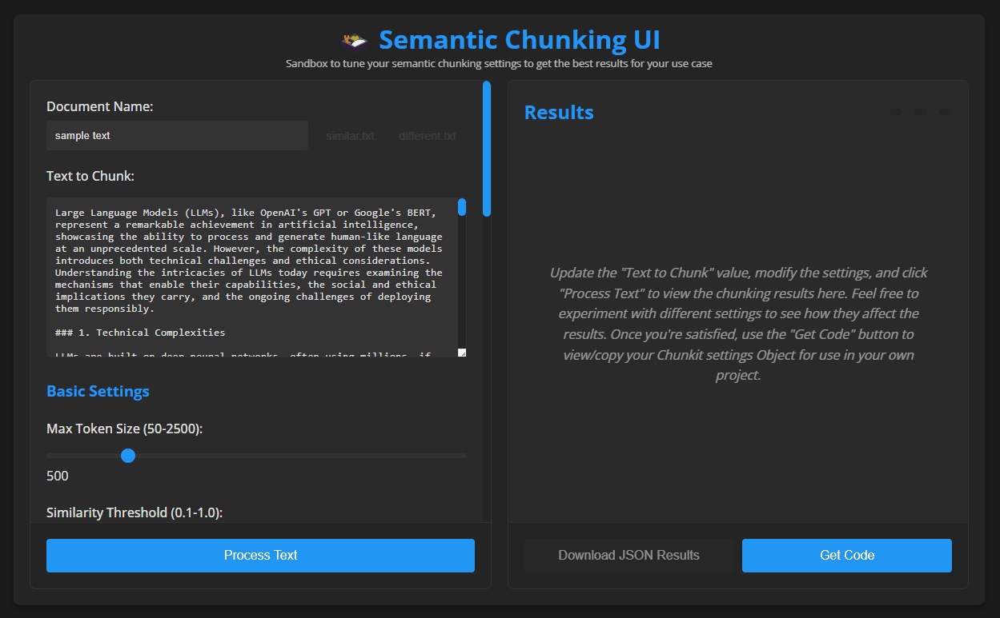

# 🍱 Semantic Chunking Web UI

A web-based interface for experimenting with and tuning Semantic Chunking settings. This tool provides a visual way to test and configure the `semantic-chunking` library's settings to get optimal results for your specific use case. Once you've found the best settings, you can generate code to implement them in your project.

## Features

- Real-time text chunking with live preview
- Interactive controls for all chunking parameters
- Visual feedback for similarity thresholds
- Model selection and configuration
- Results download in JSON format
- Code generation for your settings
- Example texts for testing
- Dark mode interface



## Getting Started

### Prerequisites
- Node.js (v18 or higher recommended)
- npm (comes with Node.js)

### Installation

1. Clone the repository: 
```bash
git clone https://github.com/jparkerweb/semantic-chunking.git
```

2. Navigate to the webui directory:
```bash
cd semantic-chunking/webui
```

3. Install dependencies:
```bash
npm install
```

4. Start the server:
```bash
npm start
```

5. Open your browser and visit:
```bash
http://localhost:3000
```

## Usage

### Basic Controls

- **Document Name**: Name for your input text
- **Text to Chunk**: Your input text to be processed
- **Max Token Size**: Maximum size for each chunk (50-2500 tokens)
- **Similarity Threshold**: Base threshold for semantic similarity (0.1-1.0)
- **Similarity Sentences Lookahead**: Number of sentences to look ahead when calculating similarity (1-10)

### Advanced Settings

- **Dynamic Threshold Bounds**: Lower and upper bounds for dynamic similarity threshold adjustment
- **Combine Chunks**: Enable/disable chunk combination phase
- **Combine Chunks Similarity Threshold**: Threshold for combining similar chunks

### Model Settings

- **Embedding Model**: Choose from various supported embedding models
- **Quantized Model**: Toggle model quantization for reduced memory usage

### Output Settings

- **Return Token Length**: Include token count in results
- **Return Embedding**: Include embeddings in results
- **Chunk Prefix**: Add prefix to chunks (useful for RAG applications)
- **Exclude Chunk Prefix in Results**: Remove prefix from final results

### Example Texts

Use the provided example texts to test different scenarios:
- `similar.txt`: Text with high semantic similarity between sentences
- `different.txt`: Text with low semantic similarity between sentences

### Results

- View chunked results in real-time
- See chunk count, average token length, and processing time
- Download results as JSON
- Get generated code with your current settings

## Development

The web UI is built with:
- `semantic-chunking` library for text processing
- Express.js for the backend
- Vanilla JavaScript (ES6+) for the frontend
- CSS3 for styling

## License

This project is licensed under the MIT License - see the LICENSE file for details.

## Appreciation

If you enjoy this package please consider sending me a tip to support my work 😀
# [🍵 tip me here](https://ko-fi.com/jparkerweb)
